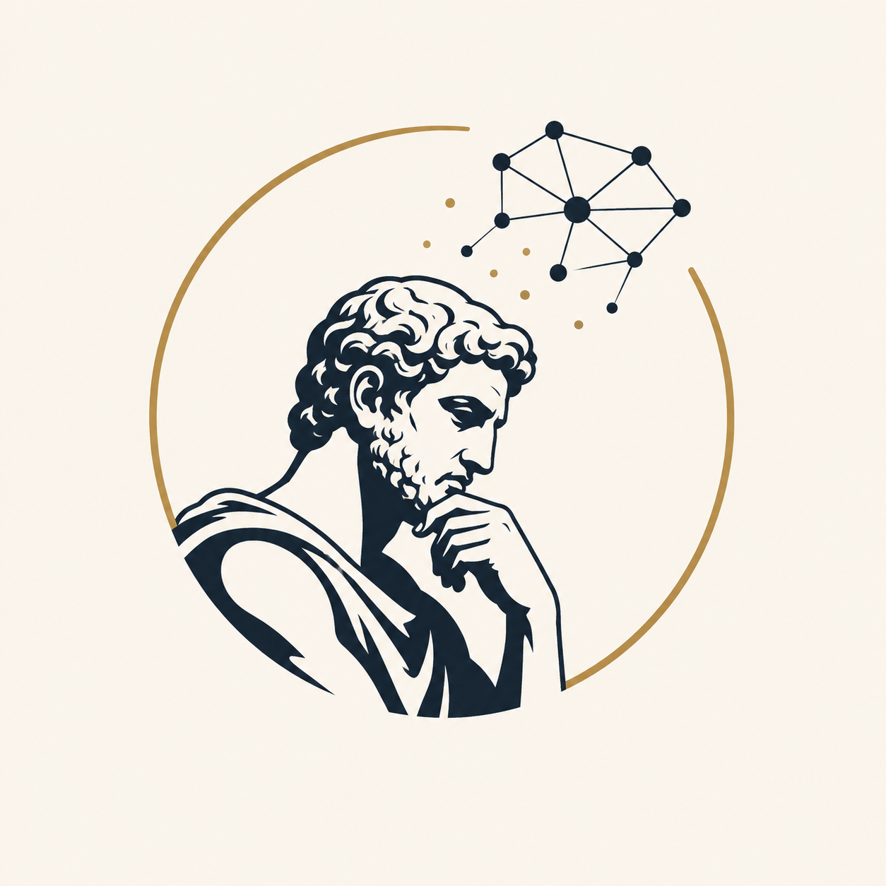

# Archimedes Agent

<p align="center">
  
</p>

<p align="center">
  <strong>A local-first, IDE-style drawing workspace for system design diagrams and wireframes.</strong>
</p>

<p align="center">
  Like VS Code or Cursor, but for visual architecture and product-design work: files, tabs, diagram context, and AI agents that understand the canvas.
</p>

<p align="center">
  
  
  
  
</p>

Archimedes is a diagram-native workspace for reasoning about systems and interfaces. It combines an Excalidraw-based canvas with a workspace-aware assistant that can review visual designs, call out architectural risks, and help evolve diagrams over time. The long-term direction is a serious open-source visual IDE: file management, tabs, local-first desktop workflows, and focused agents for review, completion, and design assistance.

## Demo

<video src="docs/assets/archimedes-v0-demo.mp4" controls width="100%" title="Archimedes V0 demo"></video>

If the embedded player does not render on your client, open the demo directly: [`docs/assets/archimedes-v0-demo.mp4`](docs/assets/archimedes-v0-demo.mp4).

The demo shows the V0 workflow: opening the workspace, drawing with the Excalidraw canvas, requesting an AI review, receiving actionable feedback, and continuing the diagramming loop.

## Why Archimedes?

System design and wireframe tools are visual, but they rarely feel like developer tools. AI chat tools can discuss architecture, but they are not diagram-native and usually do not understand the workspace around the drawing.

Archimedes brings those worlds together:

- an IDE-style workspace for visual architecture and wireframe files;
- a local-first drawing surface that keeps the canvas fast and private by default;
- assistant workflows that operate on the actual diagram image, not just pasted text;
- a provider abstraction for local Ollama models and OpenAI-compatible vision models;
- a roadmap toward multiple focused agents that review, complete, and improve diagrams in context.

## Core features

### Available today

- **Excalidraw drawing surface** for system diagrams, wireframes, arrows, labels, frames, and freeform sketches.
- **Persistent assistant panel** for manual reviews, diagram-aware chat, and proactive observations.
- **Vision-capable diagram review** by exporting the current canvas as an image and sending it to the configured model.
- **Local Ollama support** with image input through `/api/chat`.
- **OpenAI-compatible provider support** for streaming `/chat/completions` endpoints that accept multimodal messages.
- **Local persistence** for the current scene, chat history, and provider settings.
- **Desktop and browser development paths** through Tauri, Vite, React, and TypeScript.

### Roadmap direction

- **Review agent** that critiques diagrams for correctness, missing pieces, scalability, risks, and tradeoffs.
- **Autocomplete / completion agent** that suggests or creates the next useful diagram elements.
- **Design assistant / copilot** for wireframes, visual layouts, and system-design structure.
- **Workspace-aware assistant** that understands files, tabs, projects, and diagram history.
- **Native file/folder handling** with stronger desktop OS integration.
- **CLI and Open-with workflows** for launching Archimedes directly from project folders or diagram files.

## Quick start

### One-line desktop install

Linux/macOS bash:

```bash
curl -fsSL https://raw.githubusercontent.com/Shashank-H/archimedes-agent/main/scripts/install.sh | bash
```

Current beta preview:

```bash
curl -fsSL https://raw.githubusercontent.com/Shashank-H/archimedes-agent/main/scripts/install.sh | bash -s -- --beta
```

Windows PowerShell:

```powershell
powershell -NoProfile -ExecutionPolicy Bypass -Command "irm https://raw.githubusercontent.com/Shashank-H/archimedes-agent/main/scripts/install.ps1 | iex"
```

Current beta preview:

```powershell
powershell -NoProfile -ExecutionPolicy Bypass -Command "& ([scriptblock]::Create((irm https://raw.githubusercontent.com/Shashank-H/archimedes-agent/main/scripts/install.ps1))) -Beta"
```

The installers download the latest GitHub Release for your OS. Use `--beta` / `-Beta` to install the newest published prerelease. Linux prefers `.deb` or `.rpm` packages when the matching package manager is present and falls back to an AppImage launcher at `~/.local/bin/archimedes`.

### Browser/dev mode

Requirements: Node.js 24+, npm, and either Ollama or an OpenAI-compatible vision model endpoint.

```bash
npm install
npm run dev
```

Open the Vite dev server:

```txt
http://localhost:1420
```

### Desktop/Tauri mode

Install Rust/Cargo and the Tauri platform dependencies for your OS, then run:

```bash
npm run tauri -- dev
```

Build a desktop bundle:

```bash
npm run tauri -- build
```

Windows packaging notes live in [`docs/plans/BUILD_WINDOWS.md`](docs/plans/BUILD_WINDOWS.md).

### Production frontend build

```bash
npm run build
```

## Model/provider setup

Archimedes sends the current diagram as an image, so the selected model must support vision input. Text-only models may connect successfully but fail during review or ignore the diagram.

### Ollama

Start Ollama:

```bash
ollama serve
```

Ensure your vision model is available:

```bash
ollama show gemma4:e4b
```

Default settings:

```txt
Endpoint: http://localhost:11434
Model: gemma4:e4b
```

See [`docs/plans/OLLAMA_IMAGE_TEST.md`](docs/plans/OLLAMA_IMAGE_TEST.md) for notes from image-input validation.

### OpenAI-compatible providers

In **Settings**, set **API shape** to **OpenAI-compatible** and configure:

```txt
Endpoint / base URL: https://api.openai.com/v1
Model: a vision-capable chat model
API key: your provider token, if required
```

Local servers such as LM Studio or vLLM can work if they expose streaming OpenAI-style `POST /chat/completions` with multimodal message content.

For deeper usage and troubleshooting, see [`docs/USAGE.md`](docs/USAGE.md) and [`docs/TROUBLESHOOTING.md`](docs/TROUBLESHOOTING.md).

## Desktop app and OS integration

Archimedes is built with Tauri so the same React workspace can run as a desktop app. Browser/dev mode is the easiest way to try the project today. Native packaging, signed installers, better file/folder handling, Open-with support, and OS-level workflows are active product directions.

## Architecture overview

Archimedes uses React + TypeScript for the UI, Excalidraw for the drawing canvas, Tauri for desktop packaging, and a class-based provider abstraction for local or remote LLM backends. The assistant flow is image-first: the app exports the current diagram to an image, adds a lightweight metadata summary, and streams model feedback into the assistant panel.

Read more in:

- [`docs/ARCHITECTURE.md`](docs/ARCHITECTURE.md) — implementation architecture and data flow.
- [`docs/DEVELOPMENT.md`](docs/DEVELOPMENT.md) — development and build notes.
- [`docs/CURRENT_STATE.md`](docs/CURRENT_STATE.md) — current project status.

## Privacy and local-first model

Archimedes is local-first by default:

- diagrams, chats, and settings are stored in browser/webview local storage;
- the default model endpoint is local Ollama on `localhost`;
- diagram images and prompts are sent only to the provider endpoint you configure;
- API keys stay in local app storage and are not committed by the app;
- PostHog analytics are disabled unless explicitly enabled at build time.

If you configure a remote provider, the current diagram image, prompt, and lightweight diagram metadata are sent to that provider for the requested review or chat response.

When analytics are enabled, Archimedes only emits lightweight product events such as app load, review start/completion/failure, provider connection test result, and chat clear. It does **not** capture diagram images, prompts, chats, endpoints, API keys, or full scene data.

## Contributing

Contributions are welcome, especially around workspace/file UX, provider support, agent workflows, desktop packaging, and documentation.

1. Install dependencies with `npm install`.
2. Run the app with `npm run dev`.
3. Validate production output with `npm run build`.
4. Read [`AGENTS.md`](AGENTS.md) for project coding conventions before making UI or architecture changes.
5. Use GitHub issues for bugs, design proposals, and roadmap discussion.

Useful docs:

- [`docs/USAGE.md`](docs/USAGE.md)
- [`docs/ARCHITECTURE.md`](docs/ARCHITECTURE.md)
- [`docs/DEVELOPMENT.md`](docs/DEVELOPMENT.md)
- [`docs/RELEASES.md`](docs/RELEASES.md)
- [`docs/TROUBLESHOOTING.md`](docs/TROUBLESHOOTING.md)

## License

This project is released under the [GNU AGPL-3.0](LICENSE).

## Acknowledgements

Archimedes builds on excellent open-source tools, including [Excalidraw](https://github.com/excalidraw/excalidraw), [React](https://react.dev/), [Tauri](https://tauri.app/), [Vite](https://vite.dev/), and [Ollama](https://ollama.com/).
